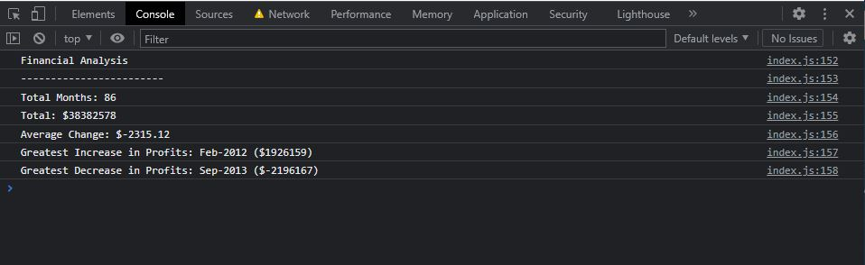

# Console-Finances

## Description
In this project I have been using JavaScript to make financial analysis in a console.

This is result in console:

## Installation
N/A

## Usage
This code will calculate a number of Months, total profit/loss of the months, average change, greatest increase/decrease of entire period.

Link to live page: [Click here](https://markubil.github.io/Console-Finances/)

## Credits
N/A

## License
 GNU GENERAL PUBLIC LICENSE

 Version 3, 29 June 2007

 Copyright (C) 2007 Free Software Foundation, Inc. <https://fsf.org/>
 Everyone is permitted to copy and distribute verbatim copies
 of this license document, but changing it is not allowed.

## Badges

